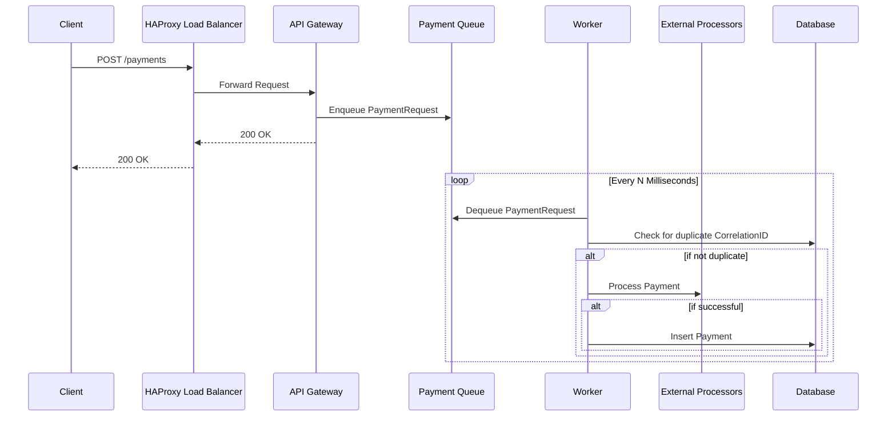
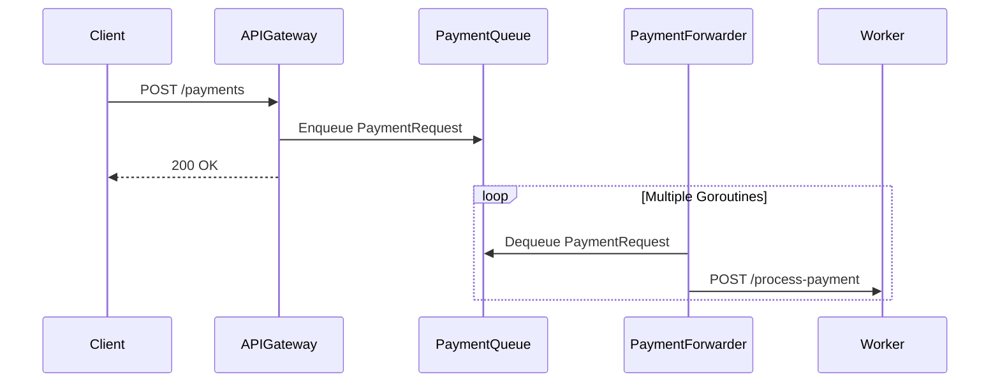
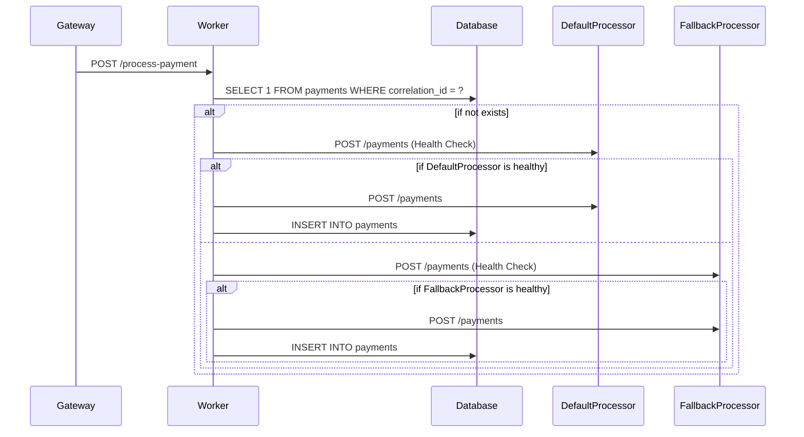

# Low-Level Design: Rinha Backend in Go

This document provides a detailed explanation of the Rinha Backend application, written in Go. It's intended for developers with experience in other languages, like Java, C#, or PHP, to understand the Go-specific concepts and the application's architecture.

## Table of Contents

- [1. Go Language Fundamentals](#1-go-language-fundamentals)
  - [1.1. Packages and Modules](#11-packages-and-modules)
  - [1.2. Data Structures (Structs)](#12-data-structures-structs)
  - [1.3. Functions and Methods](#13-functions-and-methods)
  - [1.4. Concurrency (Goroutines and Channels)](#14-concurrency-goroutines-and-channels)
- [2. Application Architecture](#2-application-architecture)
  - [2.1. `main.go` - The Entry Point](#21-maingo---the-entry-point)
  - [2.2. `config` Package](#22-config-package)
  - [2.3. `models` Package](#23-models-package)
  - [2.4. `gateway` Package](#24-gateway-package)
  - [2.5. `worker` Package](#25-worker-package)
- [3. Key Algorithms and Patterns](#3-key-algorithms-and-patterns)
  - [3.1. Asynchronous Processing with a Queue](#31-asynchronous-processing-with-a-queue)
  - [3.2. Health Check and Circuit Breaker](#32-health-check-and-circuit-breaker)
  - [3.3. Database Connection Pooling](#33-database-connection-pooling)
  - [3.4. Database Schema (DDL)](#34-database-schema-ddl)
- [4. How to Run the Application](#4-how-to-run-the-application)

## 1. Go Language Fundamentals

Go is a statically typed, compiled language known for its simplicity, efficiency, and strong support for concurrent programming. Here are some key concepts you'll encounter in this project:

### 1.1. Packages and Modules

- **Packages:** Go code is organized into packages. A package is a collection of source files in the same directory that are compiled together. You can think of them as namespaces or modules in other languages. In our project, you'll see packages like `main`, `config`, `gateway`, `models`, and `worker`.
- **Modules:** A Go module is a collection of related Go packages that are versioned together as a single unit. Our project is a Go module, defined by the `go.mod` file. This file tracks the project's dependencies.
- **Further Reading:**
    - [An Introduction to Go](https://go.dev/doc/tutorial/getting-started)
    - [Packages](https://go.dev/tour/basics/1)
    - [Modules](https://go.dev/blog/using-go-modules)

### 1.2. Data Structures (Structs)

In Go, you create complex data types using `structs`. A struct is a collection of fields. It's similar to a `class` in Java or C# but without methods directly inside the struct definition.

**Example from our code (`models/models.go`):**

```go
type PaymentRequest struct {
    CorrelationID string    `json:"correlationId"`
    Amount        float64   `json:"amount"`
    Timestamp     time.Time `json:"timestamp,omitempty"`
    Processor     string    `json:"processor,omitempty"`
}
```

- **`type PaymentRequest struct { ... }`**: This defines a new type named `PaymentRequest` that is a struct.
- **`CorrelationID string`**: This is a field named `CorrelationID` of type `string`.
- **`` `json:"correlationId"` ``**: This is a struct tag. It provides metadata about the field. In this case, it tells the `encoding/json` package how to encode/decode this field to/from JSON.

#### Data Structs vs. Behavioral Structs

A key concept in this project's design is the separation of structs that hold data from structs that have behavior.

- **Data-Only Structs (like in the `models` package):** The `models` package is specifically for structs that represent the data entities of the application, like `PaymentRequest`. These are often called Data Transfer Objects (DTOs). Their primary purpose is to be simple containers for data that is passed between different parts of the system or used in API responses.

- **Structs with Behavior (like `APIGateway` and `Worker`):** You'll notice other, more complex structs outside the `models` package. For example, the `APIGateway` struct (in the `gateway` package) and the `Worker` struct (in the `worker` package) are not just data containers. They hold fields that manage the application's state (like HTTP clients, database connections, and channels) and have methods attached to them that implement the core logic of the application (like handling requests, processing payments, and running health checks).

This separation is intentional and is a good practice in Go. It keeps the data definitions clean and decoupled from the business logic, making the code easier to understand, maintain, and test.

- **Further Reading:**
    - [Structs](https://go.dev/tour/moretypes/2)
    - [JSON and Go](https://gobyexample.com/json)

### 1.3. Functions and Methods

- **Functions:** Functions in Go are declared with the `func` keyword. They can take zero or more arguments and return zero or more values.

- **Methods:** A method is a function with a special receiver argument. The receiver appears in its own argument list between the `func` keyword and the method name. This is how Go attaches functions to types, similar to methods in a class.

**Example from our code (`gateway/gateway.go`):**

```go
// This is a method of the APIGateway struct
func (api *APIGateway) Start() {
    // ...
}
```

- **`(api *APIGateway)`**: This is the receiver. It means the `Start` method is associated with a pointer to an `APIGateway` struct. Inside the method, `api` refers to the instance of the `APIGateway`.

- **Further Reading:**
    - [Functions](https://go.dev/tour/basics/4)
    - [Methods](https://go.dev/tour/methods/1)

### 1.4. Concurrency (Goroutines and Channels)

Go has built-in support for concurrency using goroutines and channels.

- **Goroutines:** A goroutine is a lightweight thread managed by the Go runtime. You can start a new goroutine by using the `go` keyword before a function call.

- **Channels:** Channels are a typed conduit through which you can send and receive values with the `<-` operator. They are the primary way to communicate between goroutines.

**Example from our code (`gateway/gateway.go`):**

```go
// In NewAPIGateway:
api.paymentQueue = make(chan models.PaymentRequest, config.QueueSize)

// In Start:
for i := 0; i < config.NumWorkers; i++ {
    go api.paymentForwarder()
}

// In paymentForwarder:
for req := range api.paymentQueue {
    api.forwardPayment(req)
}
```

- **`make(chan models.PaymentRequest, config.QueueSize)`**: This creates a buffered channel that can hold `config.QueueSize` `PaymentRequest` objects.
- **`go api.paymentForwarder()`**: This starts a new goroutine that runs the `paymentForwarder` method.
- **`for req := range api.paymentQueue`**: This is how a goroutine can receive values from a channel. The loop will block until a value is available on the channel.

- **Further Reading:**
    - [Goroutines](https://go.dev/tour/concurrency/1)
    - [Channels](https://go.dev/tour/concurrency/2)

## 2. Application Architecture

Our application follows a microservice-like architecture with two main components: the **API Gateway** and the **Worker**. These can be run in the same process or as separate processes, determined by the `MODE` environment variable. The entire stack is designed to run on **Red Hat Universal Base Images (UBI)** for enhanced security and stability, with **HAProxy** acting as the load balancer.



### 2.1. `main.go` - The Entry Point

The `main` function in `api/main.go` is the entry point of our application. It reads the `MODE` environment variable to decide whether to start the API Gateway or the Worker.

```go
// api/main.go
func main() {
    config.Init()
    mode := os.Getenv("MODE")
    if mode == "worker" {
        workerService := worker.NewWorker()
        workerService.Start()
    } else {
        apiGateway := gateway.NewAPIGateway()
        apiGateway.Start()
    }
}
```

### 2.2. `config` Package

The `config` package (`api/config/config.go`) is responsible for initializing the application's configuration. It reads environment variables and sets up global variables, including the database connection pool.

```go
// api/config/config.go
func Init() {
    DefaultProcessorURL = os.Getenv("DEFAULT_PROCESSOR_URL")
    FallbackProcessorURL = os.Getenv("FALLBACK_PROCESSOR_URL")
    // ...
    PostgresDSN = os.Getenv("POSTGRES_DSN")
    // ...
}
```

### 2.3. `models` Package

The `models` package (`api/models/models.go`) defines the data structures (structs) used throughout the application, such as `PaymentRequest` and `PaymentSummaryResponse`.

```go
// api/models/models.go
type PaymentRequest struct {
    CorrelationID string    `json:"correlationId"`
    Amount        float64   `json:"amount"`
    Timestamp     time.Time `json:"timestamp,omitempty"`
    Processor     string    `json:"processor,omitempty"`
}
```

### 2.4. `gateway` Package

The `gateway` package (`api/gateway/gateway.go`) implements the API Gateway. Its primary responsibilities are:

- **Receiving HTTP Requests:** It exposes a `/payments` endpoint to receive payment requests.
- **Queueing Payments:** Instead of processing the payments directly, it puts them into a channel (`paymentQueue`). This is a common pattern in Go for decoupling the request handling from the actual processing.
- **Forwarding to Worker:** Goroutines running the `paymentForwarder` method continuously read from the `paymentQueue` and forward the payment requests to the Worker via an HTTP call.
- **Asynchronous Logging:** The `PaymentLogger` (`api/gateway/payment_logger.go`) asynchronously logs payment requests to the database for compliance.



**Code Snippet (`gateway/gateway.go`):**

```go
func (api *APIGateway) handlePayments(w http.ResponseWriter, r *http.Request) {
    // ... (decode request)
    select {
    case api.paymentQueue <- req:
        // ...
    default:
        http.Error(w, "Service Unavailable", http.StatusServiceUnavailable)
    }
}

func (api *APIGateway) paymentForwarder() {
    for req := range api.paymentQueue {
        api.forwardPayment(req)
    }
}
```

### 2.5. `worker` Package

The `worker` package (`api/worker/worker.go`) is responsible for the core business logic of processing payments.

- **Receiving from Gateway:** It exposes a `/process-payment` endpoint to receive payment requests from the API Gateway.
- **Interacting with External Processors:** It calls the external payment processors (a "default" and a "fallback") to process the payment.
- **Database Interaction:** It interacts with the PostgreSQL database to check for duplicate payments and to store the results of the payment processing.
- **Health Checks:** It periodically checks the health of the external payment processors and updates their status.



**Code Snippet (`worker/worker.go`):**

```go
func (w *Worker) handleProcessPayment(wr http.ResponseWriter, r *http.Request) {
    // ... (decode request)
    go w.processPayment(req)
    wr.WriteHeader(http.StatusOK)
}

func (w *Worker) processPayment(req models.PaymentRequest) {
    // ... (check for duplicates)

    if isDefaultHealthy {
        if w.callProcessor(config.DefaultProcessorURL, req) {
            // ... (insert into database)
            return
        }
    }

    if isFallbackHealthy {
        if w.callProcessor(config.FallbackProcessorURL, req) {
            // ... (insert into database)
            return
        }
    }
}
```

## 3. Key Algorithms and Patterns

### 3.1. Asynchronous Processing with a Queue

The application uses a channel (`paymentQueue`) as a queue to handle incoming payment requests asynchronously. This has several advantages:

- **Responsiveness:** The API Gateway can immediately respond to the client without waiting for the payment to be fully processed.
- **Load Balancing:** The work is distributed among multiple `paymentForwarder` goroutines.
- **Resilience:** If the Worker is temporarily unavailable, the requests will remain in the queue (up to its capacity).

### 3.2. Health Check and Circuit Breaker

The Worker implements a simple health check and circuit breaker pattern. It periodically checks the health of the external payment processors. If a processor is unhealthy, the Worker will stop sending requests to it, preventing further failures and allowing the processor to recover.

### 3.3. Database Connection Pooling

The application uses the `pgxpool` library to manage a pool of connections to the PostgreSQL database. This is a standard practice to improve performance by reusing database connections instead of creating a new one for every query.

### 3.4. Database Schema (DDL)

The application uses a single table named `payments` to store information about the payment requests. The application code itself is responsible for creating this table if it doesn't already exist.

**DDL (Data Definition Language):**

```sql
CREATE TABLE IF NOT EXISTS payments (
    correlation_id TEXT PRIMARY KEY,
    amount         NUMERIC,
    processor      TEXT,
    created_at     TIMESTAMPTZ DEFAULT now()
);
```

**Table Creation in the Code:**

This DDL statement is executed automatically when the application starts. You can find the code for this in the `config/config.go` and `gateway/payment_logger.go` files.

**Example from `config/config.go`:**

```go
// in Init()
if _, err = pool.Exec(ctx, `CREATE TABLE IF NOT EXISTS payments (...)`); err != nil {
    // ... error handling ...
}
```

This ensures that the application can run without requiring manual database setup, which is convenient for development and deployment.

## 4. How to Run the Application

The application can be run in two modes:

- **API Gateway Mode (default):**
  ```bash
  go run ./api
  ```

- **Worker Mode:**
  ```bash
  MODE=worker go run ./api
  ```

You will also need to set the required environment variables, such as `POSTGRES_DSN`, `DEFAULT_PROCESSOR_URL`, and `FALLBACK_PROCESSOR_URL`.

## 5. Architectural Evolution: Migration to HAProxy and UBI

Originally, this project used Nginx as a load balancer and standard Alpine-based Docker images. To enhance security, stability, and performance, the architecture was migrated to use **HAProxy** for load balancing and **Red Hat Universal Base Images (UBI)** for the entire application stack.

### 5.1. Why Migrate?

- **Security and Stability:** UBI provides a hardened, enterprise-grade foundation for containers, with a clear lifecycle and support from Red Hat. Running services as non-root users, which is a default security practice in the UBI ecosystem, further hardens the application.
- **Performance:** HAProxy is a highly specialized, event-driven load balancer renowned for its performance and efficiency in high-throughput scenarios, making it a better tool for this specific challenge than a general-purpose web server like Nginx.

### 5.2. Performance Impact

The migration resulted in a significant performance improvement, most notably a **46% reduction in p99 latency** under full load, while maintaining the same high throughput.

| Metric                | Before (Nginx/Alpine) | After (HAProxy/UBI) | Change     |
| :-------------------- | :-------------------- | :------------------ | :--------- |
| **Latency (p99)**     | 2.43ms                | **1.31ms**          | **-46%**   |
| **Throughput (req/s)**| ~275                  | **~275**            | No change  |

This demonstrates that a more secure and stable platform does not have to come at the cost of performance. In this case, choosing the right tools for the job led to a faster and more robust system.

We hope this document helps you understand the Rinha Backend application. Feel free to explore the code and the linked Go documentation to learn more.
